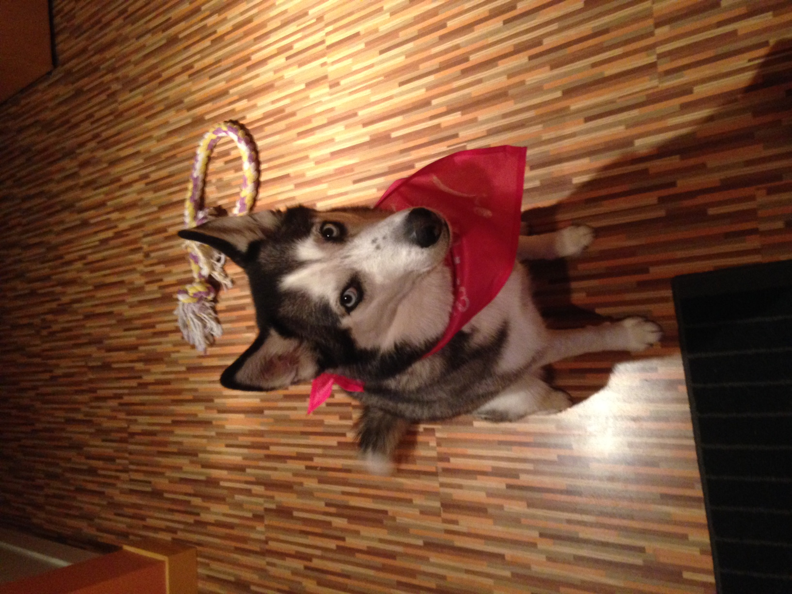

# Hello ! 👋

Hey! Welcome to my github!! Please have a look around. Most of the repos are just me practicing random youtube tutorials. I'm actually practicing with markdown as I write this. 😅 Anyway, thanks for stopping by!

---

### **Table of Contents**

1. [About Me](#about-me) 👋
1. Blockchain 🔗
1. Web2 memes 🕸️
1. Python 🐍

---

> "You miss **100%** of the shots you don't take. - Wayne Gretzky" - Michael Scott
 
## About Me

**[remingtondavids.com](https://www.remingtondavids.com)**

Hey! My name is Remington, I'm an entry level software engineer at General Motors in the GPD TRACK program. I like tinkering with things, learning new stuff, reading, movies, baseball, TV, video games, board games, card games, tabletop games, you name it!

some text   more text

## roadmap

- [x] Task #1
- [ ] Task #2
- [ ] Task #3

This is my dog Sasha; I miss her very much. 💔
